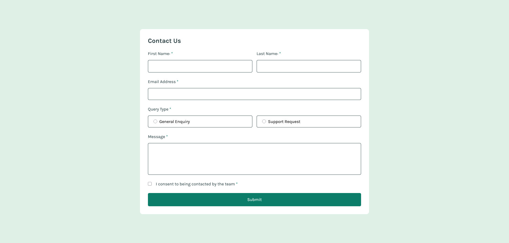
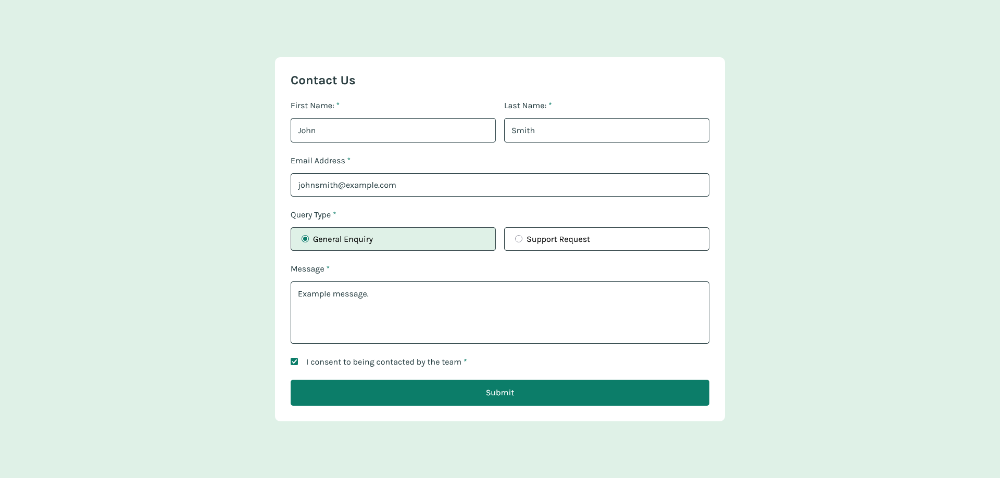
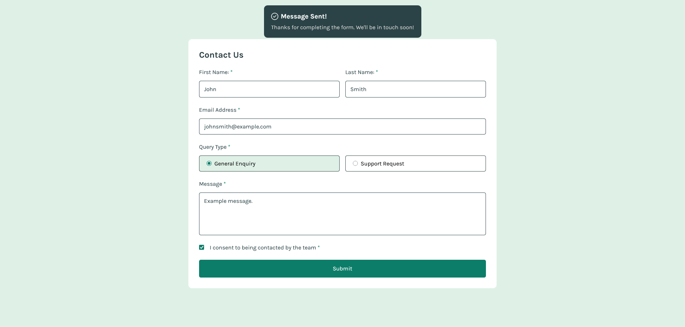
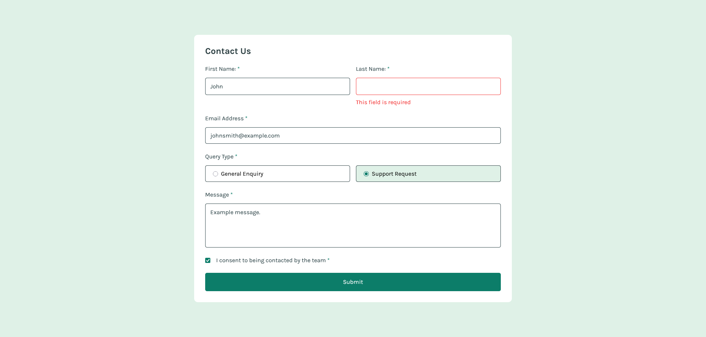
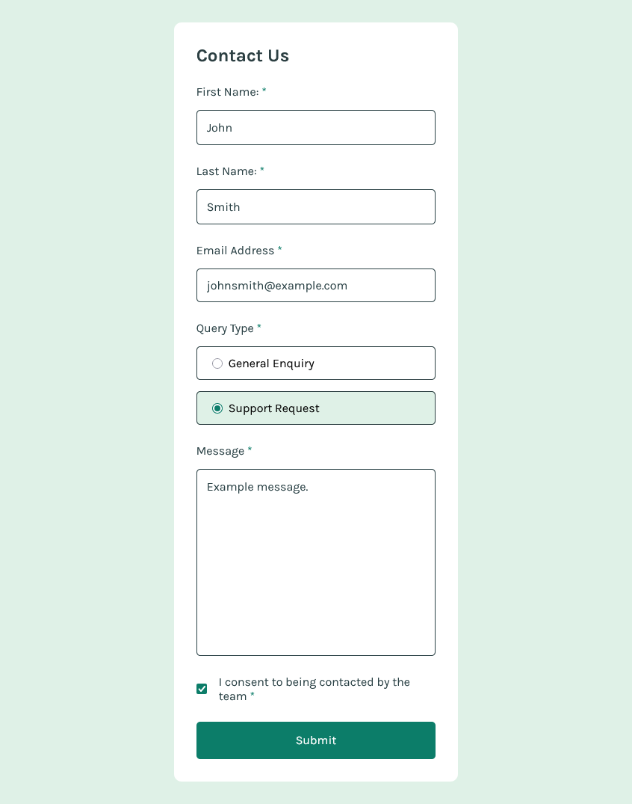
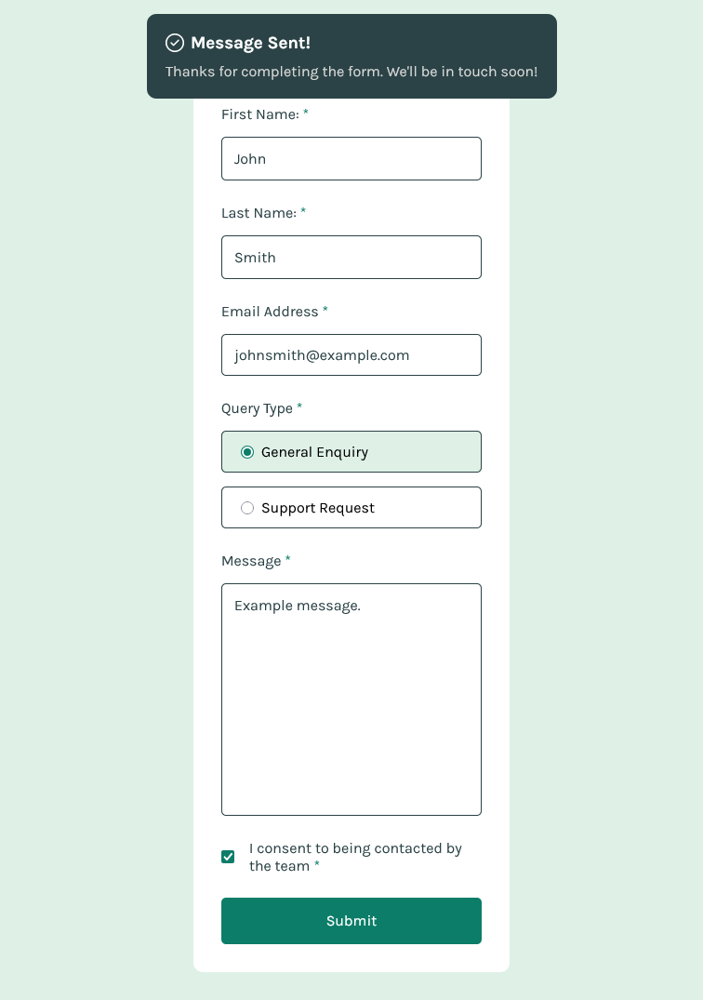

# Frontend Mentor - Contact form solution

## Description

This is a solution to the [Contact form challenge on Frontend Mentor](https://www.frontendmentor.io/challenges/contact-form--G-hYlqKJj). Frontend Mentor challenges help you improve your coding skills by building realistic projects.

## Technologies

- HTML
- CSS
- JavaScript

## Features

- Complete the form and see a success toast message upon successful submission
- Receive form validation messages if:
  - A required field has been missed
  - The email address is not formatted correctly
- Have inputs, error messages, and the success message announced on their screen reader
- View the optimal layout for the interface depending on their device's screen size

## How to Run

1. Clone the repository:
   ```bash
   git clone https://github.com/KreimerR/contact-form.git
   ```

2. Open `index.html` in your browser

## Screenshots






